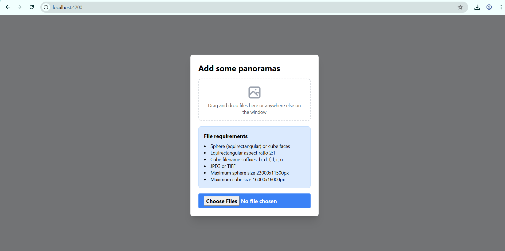
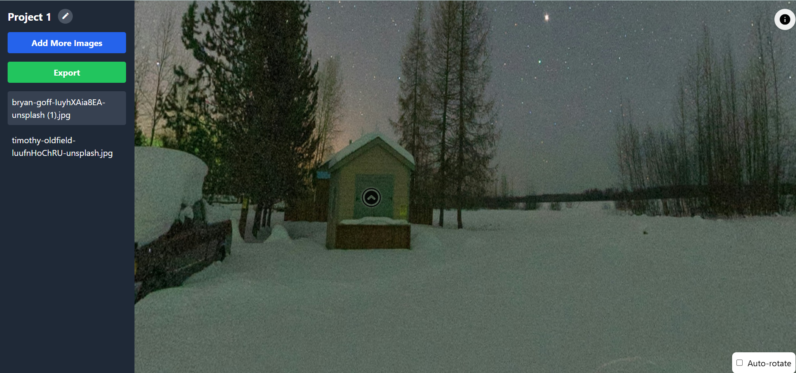

# Re360 - The 360° Panorama Tour Builder

Create stunning, interactive 360° panorama tours with this powerful and intuitive template. Perfect for real estate, tourism, virtual tours, and immersive experiences.

## ✨ What You Can Do

- **Build Immersive Tours:** Create multi-scene panorama experiences that transport viewers anywhere
- **Easy Scene Management:** Seamlessly switch between panoramas with an intuitive sidebar
- **Professional Export:** Generate complete, standalone tour packages ready for web deployment
- **Modern Interface:** Enjoy a clean, responsive design that works on all devices

## 🚀 Getting Started

### 1. **Upload Your Panoramas**
- Simply drag and drop your 360° images or click to browse
- Supports both equirectangular and cube face formats
- Automatic optimization and validation

### 2. **Customize Your Experience**
- Add interactive hotspots between scenes
- Set perfect starting views for each panorama
- Organize scenes in any order you prefer

### 3. **Export & Share**
- One-click export creates a complete tour package
- Includes all images, configuration, and viewer files
- Ready to upload to any web server

## 📱 Perfect for Any Device

The responsive design ensures your tours look great on:
- Desktop computers
- Tablets
- Mobile phones
- VR headsets

## 📋 Image Requirements

**Equirectangular Panoramas:**
- 2:1 aspect ratio (width:height)
- Maximum size: 23,000 × 11,500 pixels
- Formats: JPEG, TIFF

## 🎯 Use Cases

- **Real Estate:** Virtual property tours
- **Tourism:** Destination showcases
- **Education:** Virtual field trips
- **Events:** Venue previews
- **Museums:** Exhibition tours
- **Hotels:** Room showcases

## 🔧 Technical Features

- Built with modern web standards
- Optimized for performance
- Cross-browser compatibility
- Touch-friendly controls
- Keyboard navigation support

## Screenshots

### Add Panoramas

### Viewer with Sidebar and Scene List

---

**Ready to create your first immersive tour? Start building today!**
